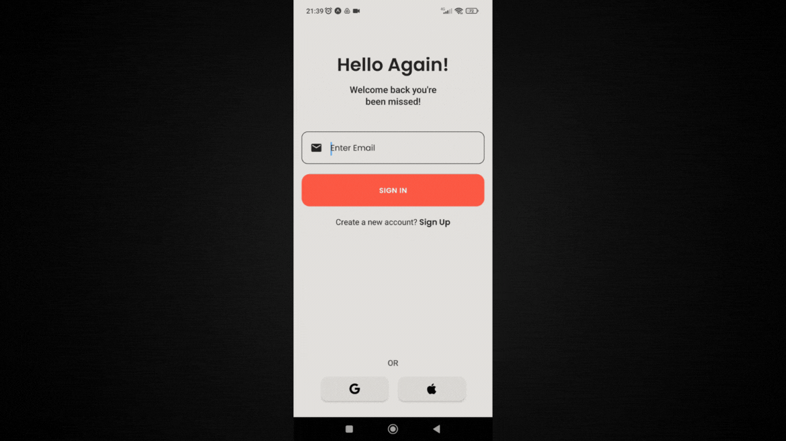

    <h2>⚜️ F I N &nbsp; T R A C K ⚜️</h2>

    <a href="#-project">Project</a>&nbsp;&nbsp;&nbsp;|&nbsp;&nbsp;&nbsp;
    <a href="#-technologies">Technologies</a>&nbsp;&nbsp;&nbsp;|&nbsp;&nbsp;&nbsp;
    <a href="#-features">Features</a>

 

    

 

## 📚 Project

Fin.Tracker is your go-to app for simplifying your financial tracking experience.

With a clean and intuitive interface, Fin.Tracker allows you to effortlessly manage your income and expenses, providing insightful analyses to help you stay on top of your finances.

 

## 🖥 Technologies

- [React-Native](https://reactnative.dev)
- [Expo](https://expo.dev)
- [TypeScript](https://www.typescriptlang.org/)
- [Tailwindcss](https://tailwindcss.com/)
- [Clerk](https://clerk.com)

 

## 🧾 Features

- [x] User auth
- [x] Income Sources
- [x] Expense Categories
- [x] Transaction History
- [x] Analysis of Spending Habits
